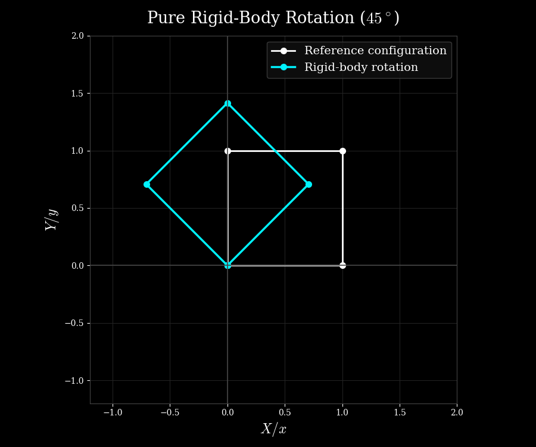

### Geometric Nonlinearity in Finite Element Analysis

Geometric nonlinearity arises when the deformation and rotation of a structure become sufficiently large that the linearized kinematic assumptions are no longer adequate. Importantly, the material itself may still behave strictly linearly (Hookean). Under these conditions, the relationship between deformation and strain must be described using finite-deformation kinematics. Consequently another layer of nonlinearity is introduced into the equilibrium equations.


### The Failure of Linear Strain

In linear elasticity, the infinitesimal strain tensor is defined as:

$$\boldsymbol{\epsilon} = \frac{1}{2} \left( \nabla_{\boldsymbol{X}} \mathbf{u} + (\nabla_{\boldsymbol{X}} \mathbf{u})^T \right)$$

This linear formulation assumes that displacement gradients ($\nabla_{\boldsymbol{X}} \mathbf{u}$) are infinitesimally small, allowing quadratic terms like $(\nabla_{\boldsymbol{X}} \mathbf{u})^T \cdot (\nabla_{\boldsymbol{X}} \mathbf{u})$ to be neglected.

However, when a body undergoes a large deformation or rotation, these quadratic terms can no longer be neglected. In particular, a pure rigid-body rotation produces non-zero strain when described using the infinitesimal strain tensor, even though the body has undergone no actual deformation. A finite-deformation strain measure, such as the Green-Lagrange strain tensor, resolves this issue by retaining the nonlinear terms required to distinguish deformation from rigid-body rotation.

!!! tip "Decoupling rigid body rotation"
    Let us quickly revisit the equations to see how this separation between deformation and rigid-body rotation arises. Recall the definition of the Green-Lagrange strain tensor:

    $$
    \mathbf{E} = \frac{1}{2} \left( \mathbf{C} - \mathbf{I} \right) = \frac{1}{2} \left( \mathbf{F}^T \cdot \mathbf{F} - \mathbf{I} \right)
    $$

    Also, recall that the polar decomposition of the deformation gradient $\mathbf{F}$ yields the following:
    
    $$
    \mathbf{F}=\mathbf{R}\mathbf{U}
    $$ 
    
    Using this in the right Cauchy-Green tensor $\mathbf{C}$, we get:
    
    $$ 
    \mathbf{C} = \mathbf{F}^T\mathbf{F} = (\mathbf{R}\mathbf{U})^T(\mathbf{R}\mathbf{U}) = \mathbf{U}^T\mathbf{R}^T\mathbf{R}\mathbf{U} 
    $$

    Since $\mathbf{R}$ is orthogonal ($\mathbf{R}^T\mathbf{R} = \mathbf{I}$) and $\mathbf{U}$ is symmetric, that is $\mathbf{U}^T = \mathbf{U}$, therefore,
    
    $$
    \mathbf{C} = \mathbf{U}^T \mathbf{U} = \mathbf{U}^2 \quad \text{and} \quad
    \mathbf{E} = \frac{1}{2}(\mathbf{U}^2 - \mathbf{I})
    $$
    
    Hence, the rigid-body rotation does not contribute to the right Cauchy-Green tensor or the Green-Lagrange strain. The Green-Lagrange strain therefore measures deformation independently of the rigid-body rotation.

Let us now see why using the Green-Lagrange strain, $\mathbf{E}$, is equivalent to retaining the quadratic displacement-gradient terms. In other words, let us revisit the derivation of Green-Lagrange Strain in terms of the displacement gradients. Starting again from the definition of the Green-Lagrange strain tensor in terms of the right Cauchy-Green deformation tensor $\mathbf{C}$:

$$\mathbf{E} = \frac{1}{2} (\mathbf{C} - \mathbf{I})$$

We also know that the current position vector $\mathbf{x}$ and the reference position vector $\mathbf{X}$ are related via the displacement vector $\mathbf{u}(\mathbf{X})$:

$$\mathbf{x}(\mathbf{X}) = \mathbf{X} + \mathbf{u}(\mathbf{X})$$

The deformation gradient $\mathbf{F}$ is defined as the material gradient (that is gradient taken with respect to reference configuration coordinates) of the spatial or current position ($\mathbf{x}$):

$$\mathbf{F} = \nabla_{\boldsymbol{X}} \mathbf{x} = \nabla_{\boldsymbol{X}} (\mathbf{X} + \mathbf{u})$$

which becomes,

$$\mathbf{F} = \mathbf{I} + \nabla_{\boldsymbol{X}} \mathbf{u}$$

By definition, $\mathbf{C} = \mathbf{F}^T \cdot \mathbf{F}$. Substituting our expression for $\mathbf{F}$, we get:

$$\mathbf{C} = (\mathbf{I} + (\nabla_{\boldsymbol{X}} \mathbf{u})^T) \cdot (\mathbf{I} + \nabla_{\boldsymbol{X}} \mathbf{u})$$

which we can simply expand to get,

$$\mathbf{C} = \mathbf{I} \cdot \mathbf{I} + \mathbf{I} \cdot (\nabla_{\boldsymbol{X}} \mathbf{u}) + (\nabla_{\boldsymbol{X}} \mathbf{u})^T \cdot \mathbf{I} + (\nabla_{\boldsymbol{X}} \mathbf{u})^T \cdot (\nabla_{\boldsymbol{X}} \mathbf{u})$$

or,

$$\mathbf{C} = \mathbf{I} + \nabla_{\boldsymbol{X}} \mathbf{u} + (\nabla_{\boldsymbol{X}} \mathbf{u})^T + (\nabla_{\boldsymbol{X}} \mathbf{u})^T \cdot (\nabla_{\boldsymbol{X}} \mathbf{u})$$

Now, substituting $\mathbf{C}$ back into the Green-Lagrange strain formula, we get:

$$\mathbf{E} = \frac{1}{2} \left[ \mathbf{I} + \nabla_{\boldsymbol{X}} \mathbf{u} + (\nabla_{\boldsymbol{X}} \mathbf{u})^T + (\nabla_{\boldsymbol{X}} \mathbf{u})^T \cdot (\nabla_{\boldsymbol{X}} \mathbf{u}) - \mathbf{I} \right]$$

$$\mathbf{E} = \frac{1}{2} \left[ \nabla_{\boldsymbol{X}} \mathbf{u} + (\nabla_{\boldsymbol{X}} \mathbf{u})^T + (\nabla_{\boldsymbol{X}} \mathbf{u})^T \cdot (\nabla_{\boldsymbol{X}} \mathbf{u}) \right]$$

We can now split this as the linear part and the nonlinear part:

$$\mathbf{E} = \boldsymbol{\epsilon} + \frac{1}{2} (\nabla_{\boldsymbol{X}} \mathbf{u})^T \cdot (\nabla_{\boldsymbol{X}} \mathbf{u})$$

where, 

$$\boldsymbol{\epsilon} = \frac{1}{2} \left( \nabla_{\boldsymbol{X}} \mathbf{u} + (\nabla_{\boldsymbol{X}} \mathbf{u})^T \right)$$

This additional quadratic term ensures that during a pure rigid-body rotation, the Green-Lagrange strain evaluates identically to zero ($\mathbf{E} = \mathbf{0}$), as it should.

!!! success "Recap"
    - So far, we have seen that neglecting the nonlinear (quadratic) terms in the strain-displacement relationship can produce artificial strains during rigid-body rotations. 
    - Therefore  the need to invoke geometrically nonlinear kinematics (or the need to use quadratic terms in the strain definition) arises  because the linearized kinematic relationships are no longer adequate to describe the deformation and rotation of the body.
    - Note that geometric nonlinearity does not necessarily mean that the body has undergone large strains. A body can undergo a large rigid-body rotation while experiencing zero actual strain.
    - This is very easily demonstrated by the help of an example shown in the python code below. A 2D quadrilateral is rotated by 45 degrees resulting in $\mathbf{\epsilon}\neq\mathbf{0}$ and $\mathbf{E}=\mathbf{0}$. 
    - Next, we take a look at what happens to stress.

```python linenums="1" title="geometric_nonlinearity.py"
--8<-- "geometric_nonlinearity.py"
```



### What Happens to Stress?

So far, we have seen that invoking geometric nonlinearity changes the strain measure from the infinitesimal strain $\boldsymbol{\epsilon}$ to the Green-Lagrange strain $\mathbf{E}$. Naturally, this also changes how stress enters the formulation.

For the moment, let us assume that the material itself remains strictly linear elastic. In other words, there is no material nonlinearity. The constitutive relationship can then be written in the material description as:

$$\mathbf{S} = \mathbb{C}:\mathbf{E}$$

where $\mathbf{S}$ is the second Piola-Kirchhoff stress tensor and $\mathbb{C}$ is the fourth-order material elasticity tensor.

Notice something important here. The material law is still linear. If we double $\mathbf{E}$, we double $\mathbf{S}$. Therefore, there is no material nonlinearity in this constitutive equation.

However, $\mathbf{E}$ itself is nonlinear in terms of the displacement gradient:

$$\mathbf{E}=\frac{1}{2}\left[\nabla_{\boldsymbol{X}}\mathbf{u}+(\nabla_{\boldsymbol{X}}\mathbf{u})^T+(\nabla_{\boldsymbol{X}}\mathbf{u})^T\cdot\nabla_{\boldsymbol{X}}\mathbf{u}\right]$$

Therefore, even though the material law $\mathbf{S}=\mathbb{C}:\mathbf{E}$ is linear, the overall relationship between stress and displacement is nonlinear.

This is the essential point:

!!! tip "Material vs. Geometric Nonlinearity"

    Material nonlinearity means that the constitutive relationship itself is nonlinear. For example,

    $$\boldsymbol{\sigma}=\mathcal{F}(\boldsymbol{\epsilon})$$

    may no longer be a linear relationship.

    Geometric nonlinearity, on the other hand, can arise even when the constitutive relationship remains linear. The nonlinearity enters through the kinematics:

    $$\mathbf{u}\rightarrow\mathbf{E}\rightarrow\mathbf{S}$$

    Thus, a Hookean material can still lead to a nonlinear finite element problem when finite-deformation kinematics are used.

### Returning to the Weak Form

Let us now see how this geometric nonlinearity enters the weak form.

For simplicity, consider the total Lagrangian formulation, in which the equilibrium equation is expressed with respect to the reference configuration $\Omega_0$.

The internal virtual work is written as:

$$\delta W_{\mathrm{int}}=\int_{\Omega_0}\mathbf{S}:\delta\mathbf{E}\,dV$$

and the weak form of equilibrium can be written as:

$$\int_{\Omega_0}\mathbf{S}:\delta\mathbf{E}\,dV=\delta W_{\mathrm{ext}}$$

where $\delta W_{\mathrm{ext}}$ represents the virtual work of the external forces.

Compare this with the linear formulation. In linear elasticity, the internal virtual work has the form:

$$\delta W_{\mathrm{int}}=\int_{\Omega_0}\boldsymbol{\sigma}:\delta\boldsymbol{\epsilon}\,dV$$

The important difference is therefore:

$$\boldsymbol{\epsilon}\longrightarrow\mathbf{E}$$

and

$$\boldsymbol{\sigma}\longrightarrow\mathbf{S}$$

when using this material description.

But there is something deeper happening here. Since $\mathbf{E}$ depends nonlinearly on $\mathbf{u}$, its variation $\delta\mathbf{E}$ also depends on the current deformation.

Recall that

$$\mathbf{E}=\frac{1}{2}\left(\mathbf{F}^T\mathbf{F}-\mathbf{I}\right)$$

Taking its variation gives:

$$\delta\mathbf{E}=\frac{1}{2}\left(\delta\mathbf{F}^T\mathbf{F}+\mathbf{F}^T\delta\mathbf{F}\right)$$

Therefore, even with a linear elastic material, the internal virtual work is nonlinear in the displacement.

### From Weak Form to the Nonlinear Equilibrium Equation

Let us denote the internal and external virtual work by:

$$\delta W_{\mathrm{int}}(\mathbf{u})\qquad\text{and}\qquad\delta W_{\mathrm{ext}}$$

The equilibrium condition is:

$$\delta W_{\mathrm{int}}(\mathbf{u})-\delta W_{\mathrm{ext}}=0$$

for every admissible virtual displacement.

In a linear problem, the internal virtual work is a linear function of the displacement, and we can directly obtain a system such as:

$$\mathbf{K}\mathbf{u}=\mathbf{f}$$

With geometric nonlinearity, however, the internal force depends nonlinearly on the displacement:

$$\mathbf{f}_{\mathrm{int}}(\mathbf{u})=\mathbf{f}_{\mathrm{ext}}$$

Therefore, we can no longer construct one constant stiffness matrix and solve the problem in a single step.

We instead need to linearize the nonlinear equilibrium equation and solve it iteratively.

This brings us naturally to the concept of **geometric stiffness**.

### Where Does Geometric Stiffness Come From?

The nonlinear internal force can be written schematically as:

$$\mathbf{f}_{\mathrm{int}}(\mathbf{u})=\int_{\Omega_0}\mathbf{B}^T(\mathbf{u})\mathbf{S}\,dV$$

where $\mathbf{B}$ is now dependent on the deformation because the strain-displacement relationship is nonlinear.

To solve the nonlinear equilibrium equation, we linearize the internal force:

$$\mathbf{f}_{\mathrm{int}}(\mathbf{u}+\Delta\mathbf{u})\approx\mathbf{f}_{\mathrm{int}}(\mathbf{u})+\mathbf{K}_T\Delta\mathbf{u}$$

where $\mathbf{K}_T$ is the tangent stiffness matrix.

For geometrically nonlinear problems, this tangent stiffness naturally separates into two contributions:

$$\mathbf{K}_T=\mathbf{K}_{\mathrm{material}}+\mathbf{K}_{\mathrm{geometric}}$$

The first contribution comes from the constitutive relationship. For a linear elastic material, this part is associated with the material elasticity tensor $\mathbb{C}$.

The second contribution arises because the strain-displacement relationship itself is nonlinear.

In other words, even if the material is perfectly linear, the nonlinear dependence of $\mathbf{E}$ on $\mathbf{u}$ produces an additional stiffness contribution.

!!! tip "The Origin of Geometric Stiffness"

    It is useful to think of the two stiffness contributions as originating from two different sources:

    $$\mathbf{K}_{\mathrm{material}}\leftarrow\text{material constitutive response}$$

    whereas

    $$\mathbf{K}_{\mathrm{geometric}}\leftarrow\text{nonlinear kinematics}$$

    Thus, geometric stiffness does not imply material nonlinearity. It appears because the internal forces change as the geometry and stress state change.

### The Final Picture

We can now connect everything together.

In linear elasticity:

$$\mathbf{u}\rightarrow\boldsymbol{\epsilon}\rightarrow\boldsymbol{\sigma}\rightarrow\mathbf{K}\mathbf{u}=\mathbf{f}$$

The strain-displacement relationship is linear, and for a linear elastic material the constitutive relationship is also linear.

With geometric nonlinearity:

$$\mathbf{u}\rightarrow\mathbf{E}(\mathbf{u})\rightarrow\mathbf{S}(\mathbf{u})\rightarrow\mathbf{f}_{\mathrm{int}}(\mathbf{u})=\mathbf{f}_{\mathrm{ext}}$$

The material can still remain perfectly linear:

$$\mathbf{S}=\mathbb{C}:\mathbf{E}$$

but the overall finite element problem is nonlinear because $\mathbf{E}$ depends nonlinearly on $\mathbf{u}$.

Consequently, the linear stiffness matrix is replaced by a tangent stiffness matrix:

$$\mathbf{K}_T=\mathbf{K}_{\mathrm{material}}+\mathbf{K}_{\mathrm{geometric}}$$

and the resulting nonlinear equilibrium equations are solved iteratively, typically using the Newton-Raphson method.

!!! success "Recap"

    - Geometric nonlinearity changes the strain measure from the infinitesimal strain $\boldsymbol{\epsilon}$ to a finite-deformation measure such as the Green-Lagrange strain $\mathbf{E}$.
    - Even when the material remains Hookean, the constitutive relationship becomes nonlinear with respect to displacement because $\mathbf{E}$ is nonlinear in $\mathbf{u}$.
    - In a total Lagrangian formulation, this naturally leads to the use of the second Piola-Kirchhoff stress $\mathbf{S}$ and Green-Lagrange strain $\mathbf{E}$.
    - The nonlinear strain-displacement relationship makes the internal force dependent nonlinearly on displacement.
    - Linearization of the nonlinear equilibrium equation produces a tangent stiffness matrix containing both material and geometric contributions.
    - Therefore, geometric nonlinearity ultimately leads not only to a nonlinear strain measure, but also to a nonlinear weak form and an additional geometric stiffness contribution.
    - Next, we take a look at how this nonlinear equilibrium equation is solved using Newton-Raphson iterations.


### The Need for Objective Stress Measures

Just as linear strain fails under large rotations, spatial stress descriptions encounter severe limitations when geometry deforms significantly. The standard Cauchy stress tensor ($\boldsymbol{\sigma}$) is defined entirely on the current, deformed configuration ($\Omega$).

While Cauchy stress is an objective tensor (it transforms correctly under rigid-body rotations via $\boldsymbol{\sigma}^* = \mathbf{Q} \boldsymbol{\sigma} \mathbf{Q}^T$), formulating constitutive laws directly on the current configuration requires tracking the continuously changing spatial geometry. Furthermore, standard time derivatives of Cauchy stress are not objective because the frame itself is spinning.

To bypass these complexities in a Total Lagrangian framework, we pull everything back to the fixed reference configuration ($\Omega_0$). This introduces the **Second Piola-Kirchhoff stress tensor ($\mathbf{S}$)**, defined via the pull-back operation:

$$\mathbf{S} = J \mathbf{F}^{-1} \cdot \boldsymbol{\sigma} \cdot \mathbf{F}^{-T}$$

Unlike Cauchy stress, $\mathbf{S}$ is a material tensor defined entirely on reference coordinates ($\mathbf{E}_i \otimes \mathbf{E}_j$). Because the reference configuration is fixed and does not rotate with the body, $\mathbf{S}$ is inherently invariant under rigid-body rotations of the spatial frame. Crucially, $\mathbf{S}$ is work-conjugate to the Green-Lagrange strain tensor ($\mathbf{E}$).

### Manifestation in the Weak Form (Total Lagrangian Formulation)

When we transform the weak form of the momentum balance equation from the current spatial domain ($\Omega$) to the reference domain ($\Omega_0$) using the Jacobian ($J = \det\mathbf{F}$) and pull-back operators, the internal virtual work integral changes fundamentally.

In linear elasticity, the internal work uses infinitesimal strain ($\boldsymbol{\epsilon}$) and Cauchy stress ($\boldsymbol{\sigma}$). Under geometric nonlinearity, the Total Lagrangian weak form becomes:

$$\int_{\Omega_0} \mathbf{S} : \delta\mathbf{E} \, \mathrm{d}\mathbf{X} = \int_{\Omega_0} \mathbf{b}_0 \cdot \mathbf{v} \, \mathrm{d}\mathbf{X} + \int_{\partial\Omega_{0T}} \mathbf{T}_0 \cdot \mathbf{v} \, \mathrm{d}\Gamma_0$$

Notice the direct consequence of geometric nonlinearity here: the internal virtual work integrand is now the contraction of the Second Piola-Kirchhoff stress ($\mathbf{S}$) with the variation of the Green-Lagrange strain ($\delta\mathbf{E}$). Because both $\mathbf{S}$ and $\delta\mathbf{E}$ depend nonlinearly on the displacement field $\mathbf{u}$, the internal work functional is nonlinear with respect to displacements.

### Linearization: Material and Geometric Stiffness Matrices

Because the governing equilibrium equations are now nonlinear, direct solvers cannot be used. We must employ an incremental-iterative procedure such as the **Newton-Raphson method**, which requires linearizing the internal virtual work with respect to an incremental displacement ($\Delta\mathbf{u}$).

Taking the directional derivative (increment $\Delta$) of the internal virtual work gives:

$$\Delta G_{\text{int}} = \int_{\Omega_0} \Delta \left( \mathbf{S} : \delta\mathbf{E} \right) \, \mathrm{d}\mathbf{X}$$

Using the product rule for tensor contractions, the integrand expands into two distinct terms:

$$\Delta \left( \mathbf{S} : \delta\mathbf{E} \right) = (\Delta\mathbf{S}) : \delta\mathbf{E} + \mathbf{S} : (\Delta \delta\mathbf{E})$$

This expansion splits the total tangent stiffness operator into two separate physical contributions:

1. **The Material Stiffness Contribution ($(\Delta\mathbf{S}) : \delta\mathbf{E}$):**
Using the constitutive relation $\Delta\mathbf{S} = \mathbb{C} : \Delta\mathbf{E}$ (where $\mathbb{C}$ is the fourth-order tangent moduli tensor), this term accounts for changes in internal forces driven by material elasticity and straining. When discretized in finite elements, it forms the **Material Stiffness Matrix ($\mathbf{K}_m$)**.
2. **The Geometric Stiffness Contribution ($\mathbf{S} : (\Delta \delta\mathbf{E})$):**
This term arises because the strain variation $\delta\mathbf{E}$ contains the deformation gradient $\mathbf{F}$, meaning $\delta\mathbf{E}$ changes as the structure rotates. Taking the increment of $\delta\mathbf{E}$ yields:
$$\Delta(\delta\mathbf{E}) = (\nabla_{\boldsymbol{X}} \mathbf{v})^T \cdot (\nabla_{\boldsymbol{X}} \Delta\mathbf{u})$$


Substituting this into the integral yields:
$$\int_{\Omega_0} \mathbf{S} : \left[ (\nabla_{\boldsymbol{X}} \mathbf{v})^T \cdot (\nabla_{\boldsymbol{X}} \Delta\mathbf{u}) \right] \, \mathrm{d}\mathbf{X}$$


This term explicitly couples the existing pre-stress state ($\mathbf{S}$) with second-order gradients of the incremental displacement ($\Delta\mathbf{u}$). In finite element analysis, this evaluates to the **Geometric Stiffness Matrix (or Initial Stress Matrix, $\mathbf{K}_\sigma$)**.

### Summary of Tangent Stiffness

Combining both parts, the total tangent stiffness matrix assembled for Newton-Raphson iterations is the sum of these two distinct components:

$$\mathbf{K}_{\text{total}} = \mathbf{K}_m + \mathbf{K}_\sigma$$

* **$\mathbf{K}_m$:** Captures material resistance to deformation.
* **$\mathbf{K}_\sigma$:** Captures how existing internal stresses stabilize or destabilize the structure during large rotations and deformations (such as the stiffening effect of a stretched cable).