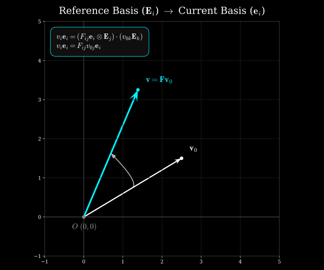
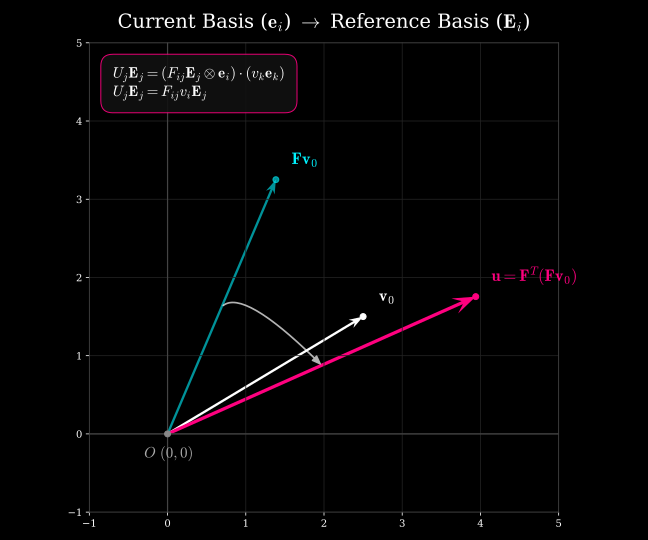
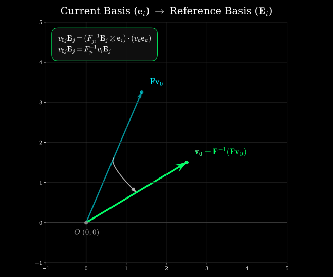
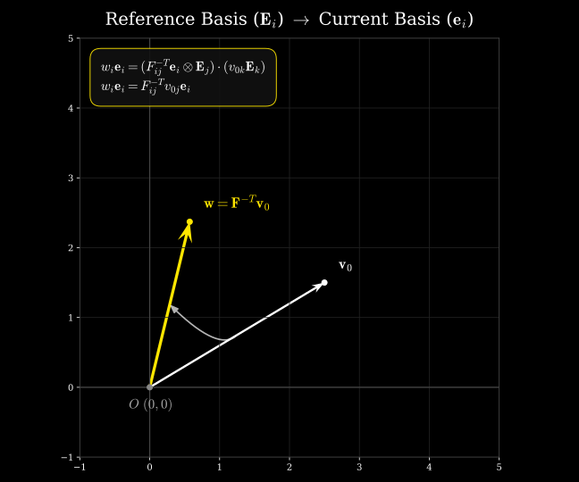

### Tensor Expressions in Terms of Basis Vectors

Following are the quantities of interest written with their proper basis vectors. Recall that basis vectors are the key indicators as to in which space a vector or a tensor lives. Also recall that a vector can be represented using different bases without changing the vector itself. 

For example, the same vector may be written as $\mathbf{v}=V_i\mathbf{E}_i$ in the reference basis or as $\mathbf{v}=v_i\mathbf{e}_i$ in another basis, with generally $V_i\ne v_i$. The vector is unchanged (provided the vector is not undergoing any transformation); only its scalar components and basis-vector representation change such that their combination represents the same geometric vector. 

For now, let $\mathbf{E}_i$ ($i=1,2,3$) represent the reference (material) coordinate basis vectors and $\mathbf{e}_i$ ($i=1,2,3$) represent the current (spatial) coordinate basis vectors.

* **Deformation Gradient** ($\mathbf{F}$): A two-point tensor mapping material (reference configuration) vectors to spatial (current configuration) vectors.

$$\mathbf{F} = F_{ij} \mathbf{e}_i \otimes \mathbf{E}_j$$

* **Cauchy Stress** ($\boldsymbol{\sigma}$): A spatial tensor defined entirely on the current configuration.

$$\boldsymbol{\sigma} = \sigma_{ij} \mathbf{e}_i \otimes \mathbf{e}_j$$

* **First Piola-Kirchhoff Stress** ($\mathbf{P}$): A two-point tensor mapping reference area vectors to spatial (current configuration) force vectors.

$$\mathbf{P} = P_{ij} \mathbf{e}_i \otimes \mathbf{E}_j$$

* **Second Piola-Kirchhoff Stress** ($\mathbf{S}$): A material tensor defined entirely on the reference configuration.

$$\mathbf{S} = S_{ij} \mathbf{E}_i \otimes \mathbf{E}_j$$

* **Green-Lagrange Strain** ($\mathbf{E}$): A material (reference configuration) strain tensor defined on the reference configuration and measuring deformation relative to the reference configuration.

$$\mathbf{E} = E_{ij} \mathbf{E}_i \otimes \mathbf{E}_j$$

* **Almansi (Euler-Almansi) Strain** ($\mathbf{e}$): A spatial (current configuration) strain tensor defined on the current configuration and measuring deformation relative to the current configuration.

$$\mathbf{e} = e_{ij} \mathbf{e}_i \otimes \mathbf{e}_j$$


---

### Transpose and Inverse

* **Transpose of the Deformation Gradient** ($\mathbf{F}^T$):

The transpose of a two-point tensor is its adjoint, which **reverses the direction of the associated mapping**. In terms of the basis vectors, the tensor-product order is reversed. Note that $\mathbf{F}$ operating on a vector in the reference configuration will yield a vector in the current configuration. On the other hand, $\mathbf{F}^T$ acting on a vector in the current configuration will yield a vector in the reference configuration. Essentially, the domain/co-domains of the two tensors are opposite to each other.  

$$\mathbf{F} = F_{ij} \mathbf{e}_i \otimes \mathbf{E}_j \quad \implies \quad \mathbf{F}^T = F_{ij} \mathbf{E}_j \otimes \mathbf{e}_i$$

The scalar components $F_{ij}$ remain unchanged; only their association with the basis vectors changes because the tensor-product order has been reversed.

* **Inverse of the Deformation Gradient** ($\mathbf{F}^{-1}$):

The inverse of $\mathbf{F}$ reverses the deformation mapping, taking spatial vectors back to material (reference configuration) vectors. Its basis representation is therefore

$$\mathbf{F}^{-1} = (F^{-1})_{ij} \mathbf{E}_i \otimes \mathbf{e}_j$$

where $(F^{-1})_{ij}$ are the components of the inverse mapping, with the first index associated with the reference basis and the second index associated with the current basis.


**Inverse Transpose of the Deformation Gradient** ($\mathbf{F}^{-T}$):

The inverse transpose can be constructed starting from $\mathbf{F}$ by first taking its transpose and then taking the inverse or vice versa.

$$\mathbf{F}^{-T} = (\mathbf{F}^{-1})^T = (\mathbf{F}^T)^{-1}$$

Using the basis representation of $\mathbf{F}$, we start with:

$$\mathbf{F} = F_{ij} \mathbf{e}_i \otimes \mathbf{E}_j$$

Here, $\mathbf{F}$ maps a vector from the reference configuration to the current configuration. The first basis vector $\mathbf{e}_i$ belongs to the current configuration, while the second basis vector $\mathbf{E}_j$ belongs to the reference configuration. After taking the transpose, it becomes:

$$\mathbf{F}^T = F_{ij} \mathbf{E}_j \otimes \mathbf{e}_i$$

The tensor-product order has now been reversed. Consequently, the associated mapping is reversed: $\mathbf{F}^T$ maps a spatial or current configuration vector to a material or reference configuration vector. Notice that the scalar components $F_{ij}$ themselves have not changed. Now, we take the inverse of $\mathbf{F}^T$:


$$\mathbf{F}^{-T} = (\mathbf{F}^T)^{-1} = (F^{-1})_{ij} \mathbf{e}_j \otimes \mathbf{E}_i$$

Here, the components are now those of the **inverse matrix** rather than those of $\mathbf{F}$. At the same time, the basis order is reversed again because we are taking the inverse of $\mathbf{F}^T$. Therefore, $\mathbf{F}^{-T}$ has the same mapping direction as $\mathbf{F}$: it maps material vectors to spatial vectors, but using the inverse-transposed components.

Thus,

$$\mathbf{F}^{-T} = (\mathbf{F}^{-1})^T = (\mathbf{F}^T)^{-1}$$

Unlike $\mathbf{F}^{-1}$, which maps spatial vectors to material vectors, $\mathbf{F}^{-T}$ maps material vectors to spatial vectors. It is particularly important for transforming normals between the reference and current configurations.

### Visualizing the various operations

For a clear visualization of the above operations, let us take a look at the following plots. These show in a geometric sense, how the vector transforms under various operations. Note that for the purpose of the followign illustrations, I have used an overlapping bases vectors (both $\mathbf{e_i}$ and $\mathbf{E_i}$ sit at the origin $(0,0)$ and are aligned perfectly). In each plot, the title shows the domain $\rightarrow$ co-domain pair. 







```python linenums="1" title="f_vis.py"
--8<-- "f_vis.py"
```

!!! warning "Work in progress: Clarification on $\mathbf{F}^T$, $\mathbf{F}^{-1}$, and $\mathbf{F}^{-T}$."

    First things first. Notice that both $\mathbf{F}^T$ and $\mathbf{F}^{-1}$ reverse the direction of the associated mapping, and clearly they are **not the same operation**, i.e., $\mathbf{F}^T \ne \mathbf{F}^{-1}$.

    The transpose i.e., $\mathbf{F}^T$ reverses the domain/co-domain of the mapping, but it does **NOT** undo the deformation.

    The inverse i.e., $\mathbf{F}^{-1}$ is the operator that **actually reverses the deformation mapping** as shown here:

    $$\mathbf{X} = \mathbf{F}^{-1}\cdot\mathbf{x}$$

    The inverse transpose $\mathbf{F}^{-T}$ is the adjoint of the inverse and is used particularly for to transform surface normals between the reference and current configurations. Recall the Nanson's formula, where $\mathbf{F}^{-T}$ is at play:

    $$J\mathbf{F}^{-T}\cdot\boldsymbol{N} = \frac{da}{dA}\boldsymbol{n}_x$$

    Thus, $\mathbf{F}^{-1}$ reverses the deformation itself, whereas $\mathbf{F}^{-T}$ appears in the transformation of normals and in pull-back/push-forward relations involving dual quantities.

    *More explanation on dual quantities, covectors and examples of pull back and push forward to be added.*